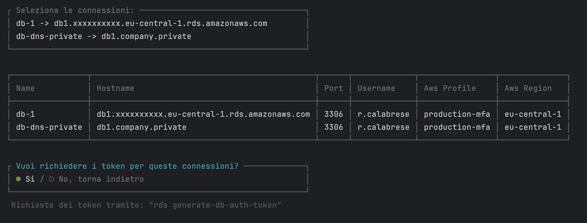

# AWS RDS Token Generator

## Introduzione

Questo progetto consiste in uno script PHP che facilita la generazione di token di autenticazione per connessioni a database RDS (Relational Database Service) su AWS (Amazon Web Services). È utile quando si desidera automatizzare il processo di richiesta di token per l'accesso ai database RDS.

## Funzionalità

- **Caricamento della configurazione**: il progetto legge un file di configurazione JSON che definisce le connessioni ai database RDS.
- **Selezione delle connessioni**: consente all'utente di selezionare le connessioni per le quali desidera generare i token.
- **Generazione dei token**: esegue i comandi AWS necessari per generare i token di autenticazione per le connessioni selezionate.
- **Gestione degli errori**: gestisce errori nel caso in cui i campi di configurazione siano mancanti o se si verificano problemi durante la generazione dei token.
- **Verifica DNS**: controlla e corregge gli hostname delle connessioni se necessario, consentendo l'accesso tramite DNS CNAME.

## Dipendenze

Il progetto utilizza diverse dipendenze PHP:

- **fostam/getopts**: Una libreria per il parsing degli argomenti della riga di comando.
- **laravel/prompts**: Una libreria per la gestione delle interazioni utente sulla riga di comando.

## Utilizzo

1. **Installazione delle dipendenze**: Assicurarsi di aver installato le dipendenze PHP elencate sopra. Questo può essere fatto utilizzando un gestore di pacchetti come Composer.
2. **Configurazione**: Creare un file di configurazione JSON seguendo il formato fornito nell'esempio. Assicurarsi di inserire tutte le informazioni necessarie per ogni connessione RDS.
3. **Esecuzione dello script**: Eseguire lo script PHP specificando il percorso del file di configurazione come argomento. Ad esempio:
    ```bash
    php rds-token-generator.php -c config.json
    ```
4. **Selezione delle connessioni**: Seguire le istruzioni visualizzate sulla riga di comando per selezionare le connessioni per le quali si desidera generare i token. 
5. **Generazione dei token**: Confermare la generazione dei token e attendere il completamento del processo.
6. **Token generati**: I token generati verranno visualizzati sulla riga di comando per ciascuna connessione selezionata.

## Contributi

Sono benvenuti contributi e suggerimenti per migliorare questo progetto. Sentiti libero di aprire una pull request o un problema per discutere le modifiche proposte.

## Avvertenza

Questo progetto è fornito senza alcuna garanzia. Si consiglia di utilizzare con cautela, soprattutto nelle configurazioni di produzione, e di testare accuratamente prima di utilizzare in ambienti critici.
